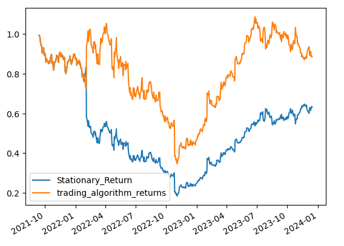

# Machine Learning Trading Strategy

In leveraging MetaStock performance data, our objective is to construct effective trading models capable of generating buy and sell signals.By employing quantitative analysis and machine learning techniques, we aim to discern patterns and trends within this data to develop robust trading strategies. The goal is to identify opportune moments to execute buy or sell orders based on the historical behavior of the underlying securities. Through the creation and optimization of these models, we seek to enhance decision-making processes in the pursuit of achieving favorable investment outcomes. 

This repository contains the code for implementing a trading strategy using historical market data. The strategy involves generating buy/sell signals based on moving average features and evaluating the performance using machine learning models.

## Features

The main features of this repository include:

### Data Processing + Technical Analysis

Raw market data is extracted via yfinance and was processed to extract relevant features, including moving averages, which are used as input for the trading strategy.
* With the use of Backtesting package, short window = 20 days and long windows = 40 days is used to derive the technical indicators. This is picked based on the highest Equity Final yield - the larger amount, the better. 

* To assure we have consistent parameters used across all algorithms, they all share n1 = 20 and n2 = 40. 
* Every algorithm yields a different buy-sell strategy, in order to evaluate which one works best - we would need to evaluate the performance metric. 
* Algorithm explored: 
    1. Simple Moving Average - look into averages over specific period [SMA]
    2. Exponential Moving Average - heavier weighting on recent data [EMA]
    3. Smoothed Simple Moving Average - a combination of simple moving average and exponential moving average [SMMA]
    4. Volume Adjusted Moving Average - weighted towards heavier volume in the data [VAMA]
    
    5. Bollinger Bands - acts as a volatility indicators, informing investor whether it's a overbought or oversold market conditions (depending on whether the price exceeds or fairly close to the upper or lower bollinger bands); as well as whether there exists high or low volatility during certain period based on the width of the bands.

### SVM Fitting with TA
* After having fit all Moving Averages into a SVM (Support Vector Machine Learning Model). To start with, we have log-ed the price returns to ensure it is stationary. We then have split the data set into training and testing data set with multiple versions of data frames.
* After multiple of Trial and Error, the final selection of training data set takes up 5 years of data from 2016 to 2021 and the testing data set takes placs from 2021 to 2023. 

* In the classification report below, we see 50%+ accuracy f1-score for both training and testing data set.

After having fitted the ML-generated Signals, below is cumulative return graphs between actuals (Stationary Return) and Trading Algorithm (via SVM) returns. 
Cumulative Returns from the Trading Algorithm seemd to have outdone the Actual Returns.

### Backtest / Performance Comparisons
Based on the Risk-Reward Metric (aka Performance Metric) across the above strategies, SMA seems to yield the best results as it has the highest Cumulative Returns, Sharpe Raio and Sortino Ratio, as well as the lowest Annual Volatility.  However, Trading Algorithm's strategy yields the highest annualised return across the above strategies, yet with a tradeoff of 46% volatility which definitely is not suitable for risk-aversed investors. 

### Baseline Algorithm

A baseline algorithm is implemented to generate buy/sell signals based on moving average crossovers.

## Modeling

Three machine learning models are applied to predict buy/sell signals based on historical data:

### Support Vector Machine (SVM)

A Support Vector Machine classifier is trained using the moving average features to predict buy/sell signals.

### Logistic Regression

A Logistic Regression model is trained using the same features to predict buy/sell signals.

### Multilayer Perceptron (MLP)

A Multilayer Perceptron (MLP) neural network is implemented for predicting buy/sell signals. The model architecture and hyperparameters can be adjusted for further experimentation.

## Strategy Evaluation

The performance of the trading strategy is evaluated using the predicted signals from the baseline algorithm and the machine learning models, including SVM, Logistic Regression, and MLP. Strategy returns are calculated and compared to actual returns to assess the effectiveness of the strategy.

# Amazon Lex Integration with Lambda and S3 for Stock Information

## Overview

Amazon Lex is a service that facilitates the creation of conversational interfaces or chatbots. In this integration, Amazon Lex is connected to a Lambda function to provide details about individual stocks. The solution is embedded into a static website hosted on Amazon S3.

## Integration Steps

### 1. Amazon Lex Configuration

- Create an Amazon Lex bot with defined intents, sample utterances, and slots to capture user queries related to stock details.

### 2. Lambda Function Integration

- Develop a Lambda function that serves as the fulfillment for the Amazon Lex bot.
- Implement logic within the Lambda function to handle different intents, query stock details from a data source, and generate responses.

### 3. Fulfillment Logic

- Implement the fulfillment logic in the Lambda function, fetching relevant stock information and formulating responses based on user queries.

### 4. AWS SDK Integration

- Use the AWS SDK within the Lambda function to interact with other AWS services or external APIs for retrieving up-to-date stock details.

### 5. Amazon S3 Website Hosting

- Host static website files (HTML, CSS, and JavaScript) on Amazon S3.
- Ensure the website files include the necessary JavaScript SDK or code snippets for interacting with the Amazon Lex chatbot.

### 6. Website Integration

- Embed the Amazon Lex chatbot into the website by adding a chat window or interface.
- Utilize the Amazon Lex runtime API to send user queries from the website to the Amazon Lex bot.

### 7. User Interaction

- Users can interact with the chatbot on the website by typing or speaking stock-related queries.
- The Amazon Lex bot processes user input, triggers the Lambda function, retrieves stock information, and sends a response back to the user.

### 8. TradeTitan Demo

- Visit the [demo website](https://tradetitanweb.s3.us-west-2.amazonaws.com/index.html) to experience the integrated solution.
- Engage with the chatbot on the website to obtain information about individual stocks.

This integration provides a seamless conversational experience on the website, allowing users to inquire about stock details using natural language. The combination of Amazon Lex, Lambda functions, and S3 hosting offers a scalable solution for building interactive and intelligent chatbot applications.

